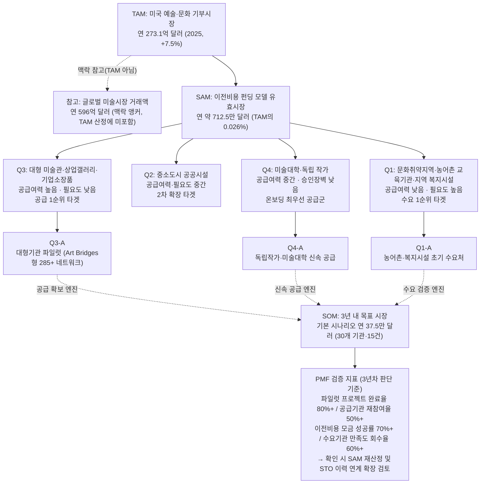

- TAM–SAM–SOM 시장 산출표

| 구분 | 규모 | 근거 |
| --- | --- | --- |
| **TAM** (미국 예술·문화 기부시장, 글로벌 미술시장 맥락 포함) | **273.1억 달러/년** | 미국 예술·문화·인문 부문 연간 기부금 (2025, +7.5%, Giving USA 2026) |
| **SAM** (이전비용 펀딩 모델 유효시장) | **약 712.5만 달러/년** | 285개 참여 가능 기관 × 1건/년 × $25,000/건, 상향식 산정. TAM의 약 0.026% |
| **SOM** (3년 내 획득 가능 시장) | **12.5만~100만 달러/년** | 3-시나리오(보수적/기본/낙관적), 한국 아트뱅크·Art Bridges Foundation 벤치마크 대조 |



> **범위 안내:** 본 TAM-SAM-SOM은 "예술품 이전비용 펀딩" 사업만을 대상으로 산정했다. 재분배된 작품의 전시·활용 이력을 기존 미술품 담보증권형 토큰(STO) 사업과 연결하는 4단계 확장은 별도 사업 트랙이며, 본 시장 규모 산정에는 포함되지 않았다.

## **예술품 재분배 × 미술품 토큰증권 가치순환 플랫폼 — 전체 분석 체계 백그라운드 문서**

---

## **1. 분석 체계 전체 구조**

### **1.1 보고서 체계도**

```
[1] TAM 정의                     미국 예술·문화 기부시장 총량으로 이론적 상한 정의
     │
     ▼
[2] SAM 재구성                    상향식 — 참여 가능 기관 수 × 프로젝트 수 × 단가로 유효시장 축소
     │
     ├── [3] 공급측 근거            미술관 수장고 미전시 95%+ (질적 지표, 정성적 존재 근거)
     │
     ├── [4] Market Segment 분석    누가 우선 공급자·수요자인가 (공급여력×필요도 2×2 분류)
     │
     ├── [5] 벤치마크 대조          한국 아트뱅크 / Art Bridges Foundation 실적 대입
     │
     ▼
[6] SOM 정의                     3년 내 현실적 획득 시장과 시나리오별 목표
```

### **1.2 분석의 논리적 흐름**

| 단계 | 질문 | 답변 근거 | 핵심 결론 |
| --- | --- | --- | --- |
| ① | 시장이 얼마나 큰가? | [1] TAM | 미국 예술·문화 기부시장 273.1억 달러/년 |
| ② | 우리 모델로 접근 가능한 시장은? | [2] SAM | 이전비용 펀딩 모델 기준 약 712.5만 달러/년 |
| ③ | 왜 이 재분배가 필요한가? | [3] 공급측 근거 | 미술관 소장품 95%+ 상시 비전시 (달러 환산 불가한 질적 근거) |
| ④ | 어떤 기관·지역이 가장 필요로 하는가? | [4] Market Segment | 문화취약지역·농어촌(수요 1순위), 대형 미술관·기업소장품(공급 1순위) |
| ⑤ | 실제로 이 모델이 작동한 전례가 있는가? | [5] 벤치마크 대조 | 한국 아트뱅크(연 130만 달러), Art Bridges Foundation(285+ 기관) |
| ⑥ | 3년 내 얼마나 가져올 수 있는가? | [6] SOM | 12.5만~100만 달러/년, 기본 시나리오 37.5만 달러/년 |

---

## **2. 핵심 수치 통합 대시보드**

### **2.1 시장 규모 체계 (단위: 달러)**

```
TAM     0 ──────────────────────────────────────────────────  273.1억     (100%, 미국 기부시장 고정값)
                                                                  │
SAM                                                        712.5만        (TAM의 약 0.026%, 고정 추정치)
                                                                  │
SOM                                       12.5만 ── 37.5만 ── 100만       (SAM의 약 1.8~14.0% / TAM의 약 0.0005~0.004%)
```

| 지표 | 보수적 | 기본 | 낙관적 | 출처 |
| --- | --- | --- | --- | --- |
| **TAM** (미국 예술·문화 기부시장) | 273.1억 달러 (단일 고정값 — 시나리오 분기 없음) | 273.1억 달러 | 273.1억 달러 | Giving USA 2026 |
| **SAM** (이전비용 펀딩 모델, 상향식) | 712.5만 달러 (단일 고정값 — 시나리오 분기 없음) | 712.5만 달러 | 712.5만 달러 | 285개 기관 × 1건/년 × $25,000/건 |
| **SOM** (3년 내 목표) | 12.5만 달러/년 (10개 기관 · 5건/년) | 37.5만 달러/년 (30개 기관 · 15건/년) | 100만 달러/년 (80개 기관 · 40건/년) | 한국 아트뱅크 · Art Bridges Foundation 벤치마크 대조 |

> TAM·SAM은 산출 방법론 자체가 달라(하향식 vs. 상향식, §4.2 참조) 시나리오 분기를 적용하지 않고 단일 추정치로 고정했다. 시나리오 분기는 SOM에만 적용된다.

### **2.2 소비자 세그먼트 규모 추정**

| 세그먼트 | 4분면 위치 | 추정 규모 | 3년 내 참여 목표 (기본 시나리오) | 검증 수준 |
| --- | --- | --- | --- | --- |
| 대형 미술관 · 상업갤러리 · 기업소장품 (공급 우선) | 공급여력 높음 · 필요도 낮음 | Art Bridges Partner Loan Network 285개 이상 (미국 기준, proxy) | 30개 기관 참여 | ✅ 공개 조사 |
| 미술대학 · 독립 작가 (신속 공급) | 공급여력 중간 · 승인장벽 낮음 | 전국 단위 규모 미확인 — 온보딩 속도 우선 후보군으로 정성 식별 | 파일럿 최우선 접촉 대상 | ⚠️ 간접 추정 |
| 문화취약지역 · 농어촌 교육기관 · 지역 복지시설 (수요 우선) | 공급여력 낮음 · 필요도 높음 | 한국 아트뱅크 누적 대여기관 2,439개소 (유사모델 벤치마크) | 연 15개 프로젝트 수혜 | ✅ 공개 조사 (벤치마크) |
| 중소도시 공공시설 (2차 확장) | 공급·필요도 중간 | 전국 단위 규모 미확인 | 3년차 확장 단계 진입 | ⚠️ 간접 추정 |
| **합계 (SAM 분모 기준)** | — | 285개 기관 (proxy 상한) | 기본 30개 / 보수 10개 / 낙관 80개 |  |

### **2.3 소비자 행동 핵심 지표**

| 지표 | 수치 | 출처 | 검증 수준 |
| --- | --- | --- | --- |
| 미술관·박물관 소장품 상시 비전시 비율 | 95% 이상 | ICCROM-UNESCO, UK Heritage Fund | ✅ 공개 조사 |
| 미국 예술·문화·인문 기부금 성장률 | +7.5% (2025) | Giving USA 2026 | ✅ 공개 조사 |
| 글로벌 미술시장 거래액 | 596억 달러 (2025) | Art Basel & UBS 2026 | ✅ 공개 조사 |
| 국내 문화예술 전체 직접관람률 | 60.2% (전년 63.0%에서 하락) | 문화체육관광부 2025 조사 | ✅ 공개 조사 |
| 국내 시각예술 직접관람률 | 7.7% (+2.1%p) | 문화체육관광부 2025 조사 | ✅ 공개 조사 |
| 국내 문화예술교육 경험률 | 8.6% (+2.2%p) | 문화체육관광부 2025 조사 | ✅ 공개 조사 |
| 국내 문화예술 참여율 | 5.8% (+1.1%p) | 문화체육관광부 2025 조사 | ✅ 공개 조사 |
| Art Bridges Partner Loan Network 참여 기관 수 | 285개 이상 | Art Bridges Foundation 공식 발표자료 | ✅ 공개 조사 |
| 한국 아트뱅크 연간 구입예산 · 구입 점수 | 약 130만 달러 / 연 350~400점 | 아트뱅크 공식 발표자료 | ✅ 공개 조사 |
| 한국 아트뱅크 누적 대여기관 수 | 2,439개소 | 아트뱅크 공식 발표자료 | ✅ 공개 조사 |
| 참여기관당 연간 프로젝트 수 | 1건/년 | 목업 SRS 문서 내부 가정 | ⚠️ 간접 추정 |
| 프로젝트당 이전비용 | $25,000 (약 120점 × 점당 $208 기준) | 목업 SRS 문서 내부 가정 | ⚠️ 간접 추정 |

---

## **3. 분석 방법론 및 한계**

### **3.1 사용된 방법론**

| 방법론 | 적용 대상 | 설명 |
| --- | --- | --- |
| **Top-down 앵커링** | TAM | 미국 예술·문화 연간 기부금 총액(Giving USA)을 이론적 상한으로 설정 — 이 사업이 "예술품 판매업"이 아닌 "이전비용 펀딩업"이기 때문에 미술시장 거래액이 아닌 기부시장을 1차 앵커로 채택 |
| **Bottom-up 추정** | SAM | 참여 가능 기관 수(285+) × 연간 프로젝트 수(1건, 가정) × 프로젝트당 비용($25,000, 가정)의 적산 |
| **벤치마크 대조법** | SOM | 한국 아트뱅크(정부 운영 유사 모델)와 Art Bridges Foundation(민간 네트워크 성숙 상한)의 실제 운영 실적을 시나리오 산정의 기준점으로 사용 |
| **2×2 매트릭스 세분화** | Market Segment | 공급 여력(X) × 예술품 필요도(Y) 축으로 기관·지역군을 4분면 분류 |
| **시나리오 분석** | SOM | 보수적/기본/낙관적 3-시나리오로 3년 목표 제시 |
| **질적 지표 보완** | TAM 배경 | 미술관 소장품 95%+ 비전시라는, 달러로 환산할 수 없는 공급측 구조적 근거를 별도 병기 |

### **3.2 방법론적 한계**

| 한계 | 영향 범위 | 보완 방안 |
| --- | --- | --- |
| **1차 조사(공급기관 인터뷰·수요기관 서베이) 미실시** | 전체 | 공급 후보기관 10~15곳, 수요기관 10곳 대상 파일럿 인터뷰 |
| **독립 산업분류 부재** (예술품 재분배+이전비용 펀딩은 NAICS/KSIC에 없음) | TAM | 하향식 시장 규모 산출 자체가 불가능 → 기부시장 프록시에 의존, 실제 배분 비중은 미확인 |
| **$25,000/프로젝트, 1건/년 가정치 미검증** | SAM | 목업 SRS 문서상 가정치일 뿐 실측 데이터 아님 — 파일럿 1~2건 완료 후 재조정 필수 |
| **285개 기관을 "참여 의향 기관"으로 등치** | SAM | Art Bridges 네트워크는 대여(loan) 목적으로 결성된 조직 — 재분배·기부 목적의 실제 참여 의향은 별도 확인 필요 |
| **미국 벤치마크와 한국 벤치마크 간 제도·통화 차이 미보정** | SAM/SOM | 환율 고정 시점, 기부 세제 혜택 차이(미국 기부공제 vs. 한국 문화기부금 특례) 등 별도 분석 필요 |
| **SOM 시나리오 자체가 목표치이지 실측치가 아님** | SOM | 파일럿 1년 차 종료 후 실제 실적 대비 시나리오 편차 재계산 |

---

## **4. 보고서 간 교차 검증**

### **4.1 정합성이 확인된 부분 ✅**

| 교차 항목 | 근거 A | 근거 B | 정합 여부 |
| --- | --- | --- | --- |
| 공급 우선 세그먼트와 SAM 산출 기준의 일치 | [4] 4분면에서 대형 미술관·기업소장품을 공급 1순위 타겟으로 지목 | [2] SAM 산출식의 "285개 참여 가능 기관"이 Art Bridges의 미술관 네트워크 회원 수 | ✅ 동일 기관군 참조 |
| SOM 벤치마크와 세그먼트 우선순위의 일치 | [4] 수요 1순위 세그먼트 = 문화취약지역·농어촌 | [5] 한국 아트뱅크의 실제 수혜처(전국 대여기관 2,439개소) | ✅ 벤치마크 모델의 실제 수혜처와 세그먼트 타겟이 일치 |
| SOM < SAM 논리 정합 | [2] SAM 712.5만 달러/년 | [6] SOM 기본 시나리오 37.5만 달러/년 (SAM의 약 5.3%) | ✅ SOM이 SAM 내에 안전하게 포함됨 |
| 공급측 질적 근거와 세그먼트 선정의 정합 | [1] 미술관 수장고 95%+ 비전시 (ICCROM-UNESCO) | [4] 대형 미술관을 "저활용 자산 보유" 공급 1순위군으로 분류 | ✅ 질적 근거가 세그먼트 선정과 직결 |
| SOM과 한국 아트뱅크 예산 규모의 정합 | [5] 한국 아트뱅크 연간 구입예산 약 130만 달러 | [6] SOM 기본 시나리오 37.5만 달러/년 (아트뱅크 예산의 약 29%) | ✅ 유사 정부모델 예산 대비 합리적 하위 비율 |

### **4.2 주의가 필요한 불일치·긴장 지점 ⚠️**

| 항목 | 긴장 내용 | 판단 |
| --- | --- | --- |
| **TAM → SAM 축소율** | TAM 273.1억 달러에서 SAM 712.5만 달러로 축소율이 99.9%를 초과한다. 이 정도의 축소가 정당한가? | SAM이 "이전비용 펀딩" 모델 하나로만 좁게 정의되었기 때문. Giving USA의 273.1억 달러는 프로젝트성 기부와 운영지원성 기부를 구분하지 않은 전체 금액이며, 그중 "예술품 물리적 이전"에 실제 쓰이는 비중은 확인된 바 없다. 좁게 정의한 것 자체는 정당하나, 이 사업이 미국 기부시장의 극히 일부 하위 카테고리에서만 작동한다는 사실은 숨기지 않고 명시해야 한다 |
| **공급 1순위 세그먼트(4분면)와 실제 온보딩 속도의 충돌** | [4]는 대형 미술관·기업소장품을 공급 1순위(고공급여력)로 지목하지만, 대형 기관은 이사회 승인·법무 검토·보험 심사 등 내부 절차가 길어 실제 온보딩 속도는 느릴 가능성이 높다. 반대로 미술대학·독립 작가는 기관 승인 절차가 거의 없어 훨씬 빠르게 공급자로 전환될 수 있다 | "공급 여력이 크다"와 "빠르게 공급자로 전환된다"는 서로 다른 축이다. 4분면 우선순위는 규모 기준으로는 타당하나, 파일럿 실행 속도 기준으로는 미술대학·독립 작가를 먼저 공략하는 편이 합리적일 수 있다. 어느 유형이 실제로 먼저 응답하는지는 실측 전까지 열린 문제로 남겨둔다 |
| **TAM과 SAM의 측정 기준 상이** | TAM은 "총 기부 달러화"(하향식, Giving USA), SAM은 "프로젝트 단가 × 건수"(상향식, 자체 가정)로 서로 다른 측정 방법을 사용한다 | 결함이 아니라 방법론적 선택이다 — Giving USA가 목적별(프로젝트성 vs. 운영지원성) 기부 비중을 공개하지 않아 하향식 필터링이 애초에 불가능했기 때문에 상향식으로 전환했다. 다만 두 수치를 같은 신뢰 구간의 추정치로 취급해서는 안 되며, TAM은 "이론적 상한", SAM은 "별도 방법론의 하위 추정치"로 구분해 읽어야 한다 |
| **$25,000/프로젝트, 1건/년 가정의 근거 취약성** | SAM 산출의 두 핵심 입력값(프로젝트당 $25,000, 기관당 연 1건)은 모두 목업 SRS 문서에서 가져온 가정치이며 실측 데이터가 아니다 | 분모(285개 기관)는 Art Bridges의 공개 통계로 검증 가능하지만, 곱해지는 두 가정치는 실측되지 않았으므로 SAM 712.5만 달러라는 결과값 전체가 "가정 위의 가정"이다. 파일럿 1~2건 완료 후 반드시 재계산이 필요하다 |

---

## **5. 데이터 출처 신뢰도 등급표**

모든 수치의 출처 신뢰도를 2단계로 분류한다.

### **✅ Tier 1: 공개 1차 조사 데이터 (직접 인용 가능)**

| 출처 | 인용 내용 | 해당 구성요소 |
| --- | --- | --- |
| Giving USA 2026 | 미국 예술·문화·인문 부문 연간 기부금 273.1억 달러 (2025, 전년 대비 +7.5%) | TAM |
| Art Basel & UBS 2026 (The Art Market Report) | 글로벌 미술시장 거래액 596억 달러 (2025) | TAM 맥락 |
| ICCROM-UNESCO / UK Heritage Fund | 전 세계 미술관·박물관 소장품의 95% 이상이 상시 비전시(수장고 보관) 상태 | 공급측 질적 근거 |
| 문화체육관광부 「2025년 국민문화예술 및 여가활동 조사」 | 문화예술 전체 직접관람률 60.2%(전년 63.0%), 시각예술 직접관람률 7.7%(+2.1%p), 문화예술교육 경험률 8.6%(+2.2%p), 문화예술 참여율 5.8%(+1.1%p) | 소비자 행동 지표 |
| Art Bridges Foundation 공식 발표자료 | Partner Loan Network 참여 미술관 285개 이상 | SAM 분모, Market Segment |
| 한국 아트뱅크(정부미술은행) 공식 발표자료 | 연간 구입예산 약 130만 달러, 연 350~400점 구입, 누적 대여기관 2,439개소 | SOM 벤치마크 |

### **⚠️ Tier 2: 미검증 가정·목표치 (참고 가능, 인용 시 주의)**

| 출처/근거 | 인용 내용 | 해당 구성요소 | 주의사항 |
| --- | --- | --- | --- |
| 목업 SRS 문서 내부 가정 | 프로젝트당 이전비용 $25,000 (약 120점 × 점당 $208 기준) | SAM 산출 | 실측 데이터 아님. 파일럿 완료 후 재검증 필요 |
| 목업 SRS 문서 내부 가정 | 참여기관당 연 1건 프로젝트 | SAM 산출 | 임의 가정치. 실제 참여 빈도는 미확인 |
| 본 분석 자체 설정 | 285개 기관을 "재분배 모델 참여 의향 기관"의 proxy로 사용 | SAM 분모 | Art Bridges는 대여(loan) 목적 네트워크 — 재분배·기부 목적 참여 의향은 별도 확인 필요 |
| 본 분석 자체 설정 | 3년 목표 시나리오 (보수 12.5만 / 기본 37.5만 / 낙관 100만 달러) | SOM | 측정치가 아니라 목표치다. 벤치마크(아트뱅크·Art Bridges) 대비 비율로 정당화했을 뿐, 독자적 실측 검증은 없음 |
