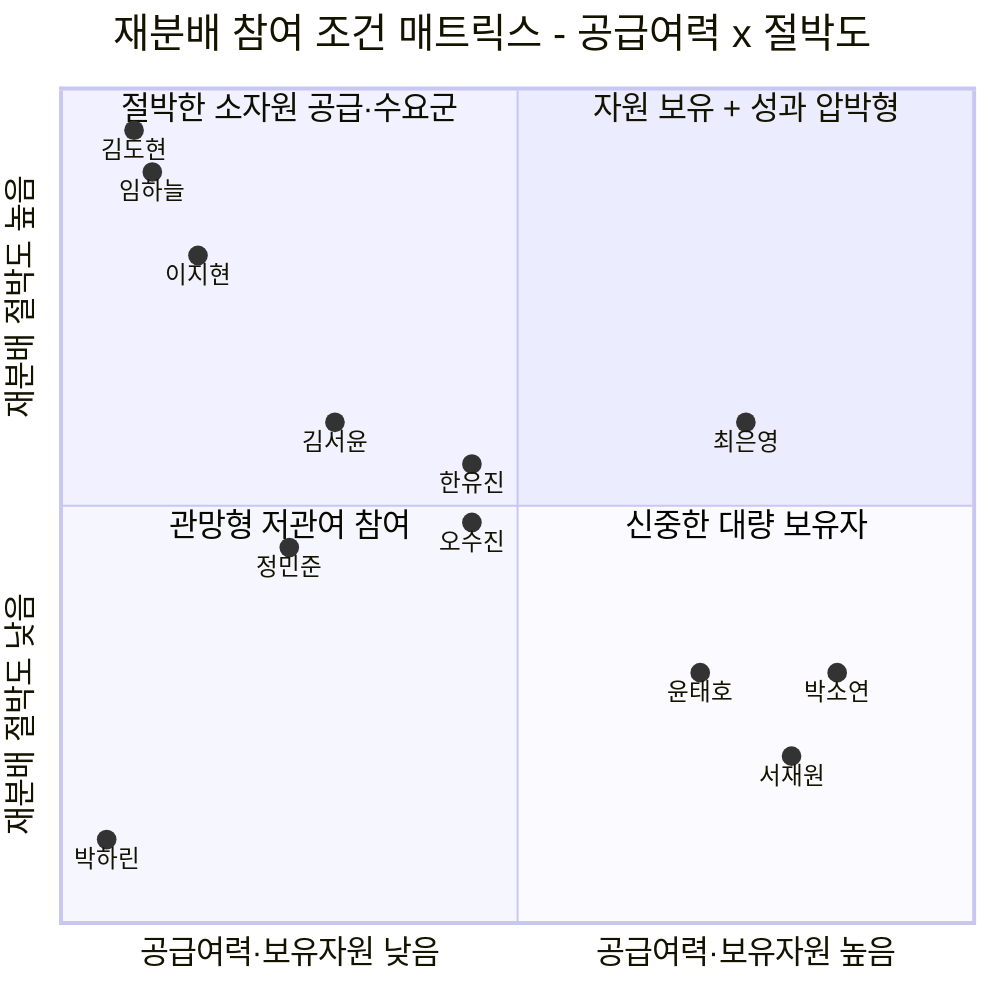
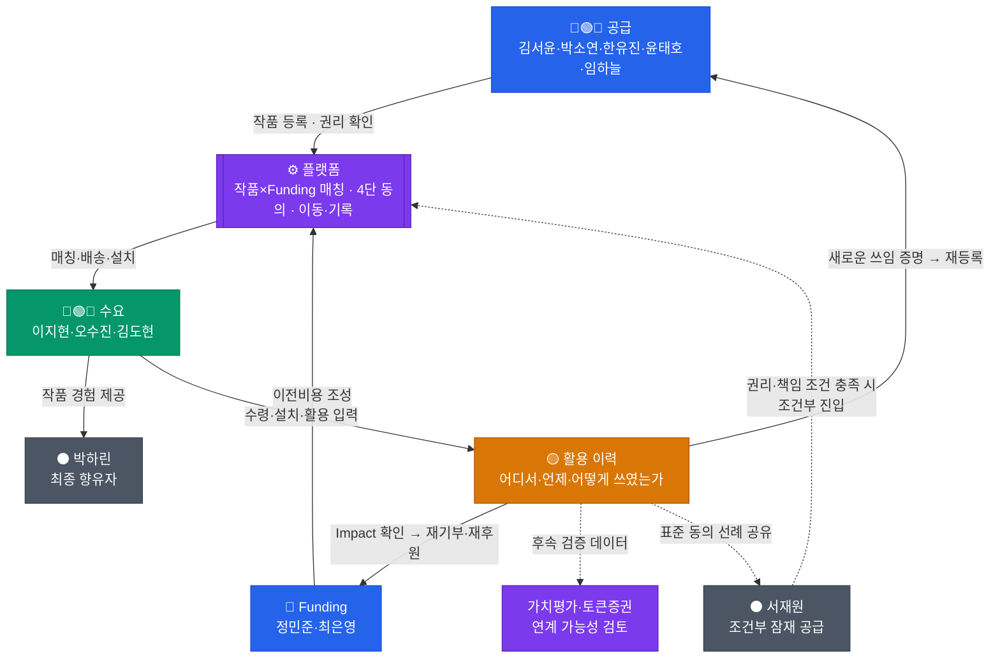
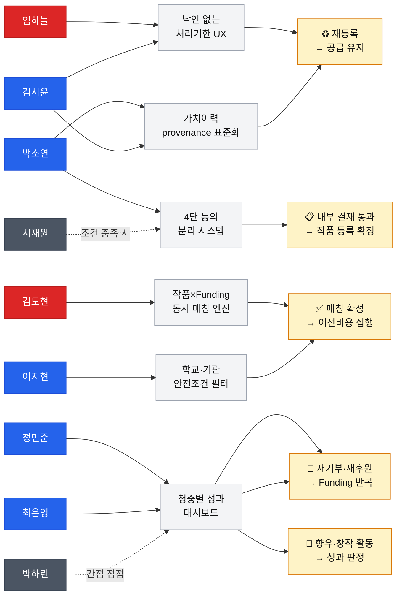
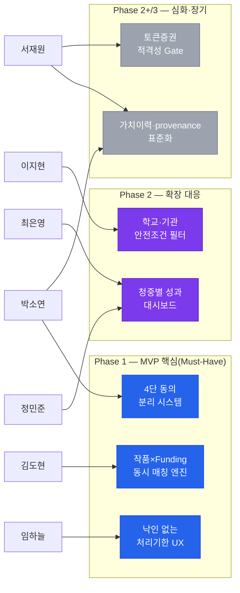

# 7. 페르소나 스펙트럼 맵 — 예술품 재분배 × 미술품 토큰증권 가치순환 플랫폼

본 문서는 12종 페르소나의 배치와 개별 프로필, 페르소나 간 연결 구조, MVP 기능 우선순위, 다섯 개의 구조 지도(Map)를 통해 **재분배(공급) · 수요 · Funding · 향유**라는 서로 다른 의사결정 축을 한 자리에서 보여주는 지식 문서다. 인물 표기는 [9_aos-dos-analysis.md](./9_aos-dos-analysis.md)·[10_jtbd-interview-report.md](./10_jtbd-interview-report.md)와 동일한 실명 기준(김서윤·박소연 등)을 쓴다.

---

## **스펙트럼 배치 (12종)**

```mermaid
graph LR
    subgraph CORE["Core 핵심 5"]
        A["독립 작가 김서윤"]
        B["미술관 컬렉션 박소연"]
        C["학교 문화예술 이지현"]
        D["개인 기부자 정민준"]
        E["기업 CSR 최은영"]
    end
    subgraph ADJ["Adjacent 확장 3"]
        F["미술대학 한유진"]
        G["갤러리 윤태호"]
        H["지역문화시설 오수진"]
    end
    subgraph EXT["Extreme 극단 2"]
        I["신진 작가 임하늘"]
        J["NGO 김도현"]
    end
    subgraph NON["Non-user 비활성 2"]
        K["기관자산 서재원"]
        L["학생 박하린"]
    end
    CORE --> ADJ --> EXT --> NON
```



## **12종 요약**

| 유형 | 인물(직무) | 역할 | 핵심 문제 | 대체 솔루션(가설) |
|---|---|---|---|---|
| 핵심 | 독립 작가 김서윤 | 공급 | 미판매 작품이 새 쓰임 없이 누적 | 계속 보관·저가 판매·지인 기증·폐기 |
| 핵심 | 미술관 컬렉션 박소연 | 공급(기관) | 유휴 소장품, 보존 책임 때문에 처분 어려움 | 수장고 장기 보관·기관 간 대여 |
| 핵심 | 학교 문화예술 이지현 | 수요 | 학생이 실제 작품을 접할 기회 부족 | 미술관 견학·온라인 이미지·단기 예술교육 |
| 핵심 | 개인 기부자 정민준 | Funding | 기부 결과를 구체적으로 체감하기 어려움 | 일반 NGO 기부·문화재단 후원 |
| 핵심 | 기업 CSR 최은영 | Funding | 사회공헌 성과를 수치로 설명하기 어려움 | 일반 현금기부·기존 CSR 프로그램 |
| 확장 | 미술대학 한유진 | 공급(교육기관) | 졸업작품의 반환·보관·권리 처리 필요 | 학생 반환·교내 보관·폐기 |
| 확장 | 갤러리 윤태호 | 공급 | 작가 계약·권리 때문에 임의 재분배 어려움 | 재전시·할인 판매·작가 반환 |
| 확장 | 지역문화시설 오수진 | 수요(공공시설) | 공간은 있으나 지속 작품 확보 예산·콘텐츠 부족 | 지역작가 섭외·단기 기획전 |
| 극단 | 신진 작가 임하늘 | 공급(보관한계) | 보관이 작업공간 자체를 압박 | 외부 창고·저가 판매·폐기 |
| 극단 | NGO 김도현 | 수요(자원 의존) | 작품·운송비를 자체 조달하기 어려움 | 단기 문화사업·현지 조달 |
| 비활성(제약형) | 기관자산 서재원 | 잠재 공급 | 권리·보존·책임 불명확으로 진입 못함 | 기존 보관 유지·원소유자 반환 |
| 비활성(비접근형) | 학생 박하린 | 최종 향유자 | 실제 작품을 일상적으로 접할 기회 제한적 | 온라인 이미지·교과서·미술관 견학 |

> 🔍 **JTBD 예행연습(챕터 07)이 13번째 표본을 발견했다** — 재분배 참여를 포기한 독립 작가(R8). 12종 어디에도 없던 인물로, "폐기"보다 "낙인"이 더 큰 이탈 장벽일 수 있음을 드러냈다. 상세는 [10_jtbd-interview-report.md](./10_jtbd-interview-report.md) 참조.

## **사전 설득 대상 (스펙트럼 밖 운영 이해관계자)**

작가·저작권자, 기관 자산·법무 담당, 작품 상태·보존 검토자, 운송·보험 파트너, 수령기관 시설 책임자, 가치평가·토큰증권 전문가 — 이들은 고객이 아니라 **작품 한 점이 실제로 이동하기 위해 승인·계약·검토가 필요한 운영 이해관계자**다. 이 명부에서 가장 중요한 데이터 접점은 수령·설치·활용 확인이다. 이 기록이 없으면 공급자는 작품이 어디서 어떻게 쓰이는지 확인할 수 없고, 기부자는 자신의 돈이 무엇을 움직였는지 증명받기 어렵다. 전체 명부는 리서치 저장소 `05-persona-journey` 챕터의 원본 분석에 정리돼 있다.

---

## **1. 핵심 사용자 (Core) — 5명**

### **C1. 김서윤 (34) — "팔리지 않아도 쓰임은 끝나지 않았다"**

**역할:** 독립 작가 · 작품 공급자

| 항목 | 내용 |
|---|---|
| **배경** | 미판매·미전시 작품이 작업실에 쌓여 있지만 애착 때문에 처분을 미루는 전형적 독립 작가다. 재분배 이후 작품이 실제로 어디서 어떻게 쓰이는지 확인받는 순간 재등록으로 이어지는 고빈도 사용자다. |
| **첫 접점** | 작업실을 정리하다가 지인 소개로 재분배 플랫폼의 존재를 처음 접한다. |
| **전환 조건** | 재분배·기록·상업활용·증권연계 4단 동의가 등록 화면에서 분리 표시되고, 등록 전에 예상 수요처 유형을 미리 볼 수 있을 때 "어디로 가는지 알고 보내는 거면 해볼 만하다"는 확신으로 넘어간다. |
| **이탈 위험** | 픽업 이후 설치·활용 결과를 회신받지 못하면 재등록 동기 자체가 사라진다. |

### **C2. 박소연 (41) — "전시되지 않는 작품의 다음 공간"**

**역할:** 미술관·박물관 컬렉션 담당자 · 작품 공급자(기관)

| 항목 | 내용 |
|---|---|
| **배경** | 장기간 활용되지 않는 소장품이 있지만 보존·관리 책임 때문에 단순 처분이 어렵고 적절한 활용처를 찾기도 어렵다. 개인 작가와 달리 보존 책임과 내부 결재가 모든 결정을 앞선다. |
| **첫 접점** | 소장품 실사나 수장고 정리 과정에서 장기 미전시 작품 목록을 확보하며 재분배 옵션을 탐색한다. |
| **전환 조건** | 재분배·기록·상업활용·증권연계 4개 항목이 별도 체크박스·서명란으로 분리되고, 권리관계·작품 상태·운송·보험 조건이 결재 첨부용 1페이지 요약으로 정리될 때 결재선을 통과시킨다. |
| **이탈 위험** | 훼손·분실 시 책임 소재가 불명확하거나 적합한 수요처·운송 조건을 확인할 수 없으면 결재 자체가 중단된다. |

### **C3. 이지현 (39) — "학교에서 실제 작품을 보여주고 싶다"**

**역할:** 문화취약지역 학교 문화예술 담당자 · 작품 수요자

| 항목 | 내용 |
|---|---|
| **배경** | 학생들이 실제 예술작품을 접할 기회가 적고 학교 예산만으로는 작품을 구매하기 어렵다. 작품 자체보다 안전·관리 조건이 먼저 통과돼야 하며, 관리 부담이 조금이라도 커지면 곧바로 이탈하는 페르소나다. |
| **첫 접점** | 이동거리·안전 문제로 외부 문화체험을 영상 수업으로 대체한 직후, "학교로 오는 실제 작품"을 검색하며 유입된다. |
| **전환 조건** | 공간·관리조건(온습도·보안·관람동선)이 사전에 필터링되고 수령·설치 담당이 미리 확정되어 "이 정도면 우리 학교에서 감당 가능하다"는 판단이 설 때 신청한다. |
| **이탈 위험** | 관리조건 사전 필터가 없어 신청 자체를 포기하거나, 수령·설치 일정이 불명확해 작품이 도착해도 방치되는 상황에서 이탈한다. |

### **C4. 정민준 (32) — "내 3만원이 어떤 작품을 움직였나"**

**역할:** 개인·정기 기부자 · 이전비용 지원자

| 항목 | 내용 |
|---|---|
| **배경** | 정기후원 경험은 있지만 미술품 기부는 처음이다. 결과 확인 욕구는 강하지만 "가치상승 서사"는 인터뷰에서 명확히 거부한, 그 자체로 중요한 반증 페르소나다. |
| **첫 접점** | SNS에서 재분배 프로젝트 사연을 접하고 "내 돈이 어디에 쓰이는지" 궁금해하며 프로젝트 페이지에 진입한다. |
| **전환 조건** | 운송·보험·설치 등 항목별 비용 구성이 투명하게 공개되고, 결제대행(PG) 위탁으로 최소 정보만 요구할 때 소액 기부를 결정한다. |
| **이탈 위험** | "이 기부가 작품 가치를 올렸다"는 서사를 제시하면 오히려 불쾌해하며 이탈한다 — 문화적 성과만 전달해야 신뢰가 유지된다. |

### **C5. 최은영 (44) — "사회공헌 결과를 숫자로 보여줘야 한다"**

**역할:** 기업 CSR·ESG 담당자 · 프로젝트 후원자

| 항목 | 내용 |
|---|---|
| **배경** | 사회공헌 예산을 집행해도 실제 효과를 구체적 수치로 설명하기 어렵다. 연말 성과보고 압박이 유일한 진입 계기다. |
| **첫 접점** | 연말 CSR 성과보고서 작성 기간에 재분배 프로젝트 소개를 접하며 실무적 관심을 갖는다. |
| **전환 조건** | 법무·재무·CSR 통합 실사 패키지가 한 번에 제공되고, 투자·증권 이슈가 CSR 메시지와 완전히 분리될 때 내부 결재를 완료한다. |
| **이탈 위험** | 실사 요청이 부서별로 반복 발생하거나 진행 보고 형식이 기존 ESG 보고서 양식과 맞지 않으면 다음 지원을 이어가지 않는다. |

---

## **2. 확장 사용자 (Adjacent) — 3명**

### **A1. 한유진 (29) — "졸업작품의 다음 쓰임이 필요하다"**

**역할:** 미술대학 작품관리·실기실 담당자

| 항목 | 내용 |
|---|---|
| **배경** | 졸업전시와 수업 이후 다수의 학생 작품이 남지만, 학생 개별 동의를 받는 절차가 병목이 된다. |
| **첫 접점** | 졸업전시 종료 후 보관 공간 부족을 확인하는 시점에 대량 처리 수단을 찾는다. |
| **전환 조건** | 다수 작품을 한 번에 등록하는 일괄 등록 기능과 온라인 일괄 동의 수집 링크가 있을 때 "이 정도면 관리 가능하다"고 판단한다. |
| **이탈 위험** | 학생 동의를 작품 수만큼 개별로 반복 수집해야 하면 절차 자체를 포기한다. |

### **A2. 윤태호 (37) — "미판매 작품을 마음대로 보낼 수는 없다"**

**역할:** 상업 갤러리 작품관리 담당자

| 항목 | 내용 |
|---|---|
| **배경** | 전시 이후 판매되지 않은 작품이 있지만, 작가와의 계약·권리관계 때문에 임의로 재분배하기 어렵다. |
| **첫 접점** | 미판매 작품의 외부 전시·대여 가능성을 검토하는 시점에 새로운 전시 기회를 탐색한다. |
| **전환 조건** | 계약상 권한 범위를 체크리스트로 확인하고, 후속 수익배분 원칙을 참여 시점에 미리 합의할 때 등록한다 — "나중에 돈 생긴 다음에 협의하면 싸운다"는 것이 그의 원칙이다. |
| **이탈 위험** | 배분 원칙이 사후 협의로 남으면 분쟁 소지가 생겨 참여 자체를 접는다. |

### **A3. 오수진 (46) — "공간은 있는데 보여줄 작품이 부족하다"**

**역할:** 지역 문화센터·도서관·공공문화시설 담당자 · 작품 수요자

| 항목 | 내용 |
|---|---|
| **배경** | 전시할 공간은 있지만 지속적으로 새 작품을 확보할 예산과 콘텐츠가 부족하다. |
| **첫 접점** | 전시 기획이나 공간 개편, 문화프로그램 준비 과정에서 지원 가능한 작품을 탐색한다. |
| **전환 조건** | 작품 크기·설치·관리 조건이 공간과 맞고 기관이 부담할 비용과 책임이 명확할 때 신청을 확정한다. |
| **이탈 위험** | 설치·관리 부담이 크거나 작품 정보가 공간 목적과 맞지 않으면 신청을 포기한다. |

---

## **3. 극단 사용자 (Extreme) — 2명**

### **E1. 임하늘 (27) — "작업실이 작품으로 꽉 찼다"**

**역할:** 보관 여력이 매우 작은 독립·신진 작가 · 작품 공급자

| 항목 | 내용 |
|---|---|
| **배경** | 판매되지 않은 작품이 누적되며 보관이 작업공간 자체를 압박한다. 폐기 압박과 낙인 우려가 동시에 작동하는, 스펙트럼에서 가장 예민한 페르소나다. |
| **첫 접점** | 이사나 작업실 정리 과정에서 작품 폐기를 실제로 고민하는 순간 대안을 찾는다. |
| **전환 조건** | 등록 화면에 "유휴·저평가·폐기 대상" 같은 표현이 전혀 없이 "순환 가능 작품"으로만 소개되고, 확정된 매칭 기한이 제시될 때 등록한다. |
| **이탈 위험** | 이전까지 너무 오래 걸리거나 등록·포장·운송에서 추가 비용·업무가 크게 발생하면 이탈하고, 활용 이력에 "가치가 올랐다"는 서사가 섞이면 오히려 신뢰가 무너진다. |

### **E2. 김도현 (33) — "외부 지원 없이는 작품을 확보하기 어렵다"**

**역할:** 문화취약지역 문화지원 NGO 담당자 · 수요(자원 의존)

| 항목 | 내용 |
|---|---|
| **배경** | 작품과 운송비를 자체 조달하기 어렵고, 작품과 이전비용이 동시에 확보되지 않으면 실행 자체가 무산되는 — 전체 스펙트럼 중 병목이 가장 강한 사용자다. |
| **첫 접점** | 좋은 작품 제안을 받았지만 운송비를 자비부담해야 해서 수량을 줄였던 경험 직후 대안을 찾는다. |
| **전환 조건** | 작품×Funding 동시 매칭 엔진이 목표액 100% 조성 전에는 실행을 승인하지 않는 구조를 확인하고 "이번엔 끝까지 갈 수 있겠다"고 판단할 때 신청한다. |
| **이탈 위험** | 작품과 비용이 따로 움직여 착수가 무산되는 경험이 반복되면 플랫폼 자체를 신뢰하지 않게 된다. |

---

## **4. 비활성 사용자 (Non-user) — 2명**

### **N1. 서재원 (48) — "작품은 있어도 바로 내놓을 수 없다"**

**역할:** 작품 보유기관 자산·작품관리 담당자 · 잠재 공급자(제약형)

| 항목 | 내용 |
|---|---|
| **배경** | 유휴 작품이 있어도 소유권·저작권·작가 동의·보존상태가 명확하지 않으면 재분배를 결정할 수 없는, 구조적으로 진입이 막힌 비활성 사용자다. |
| **첫 접점** | 기관의 유휴자산 정리 또는 외부 기증·이전 가능성을 검토하는 과정에서 플랫폼의 존재를 확인한다. |
| **전환 조건** | 표준 권리 체크리스트와 사고·훼손 책임 범위가 사전에 명시되어 권리·보존·책임 조건을 스스로 확인할 수 있을 때 조건부로 검토를 재개한다. |
| **이탈 위험** | 권리관계가 불명확하거나 사고 발생 시 책임 주체를 확인할 수 없으면, 대부분 진입 자체를 보류한 채 정체된다. |

### **N2. 박하린 (14) — "플랫폼은 모르지만 작품은 경험한다"**

**역할:** 문화예술 접근성이 낮은 지역의 학생 · 최종 향유자(비접근형)

| 항목 | 내용 |
|---|---|
| **배경** | 플랫폼을 직접 사용하지 않지만 서비스 성과를 실제로 체감하는 최종 수혜자다. 이 여정이 완결돼야 사업 전체의 존재 이유가 증명된다. |
| **첫 접점** | 평소 "미술관은 너무 멀다"는 무관심 상태로 지내다가, 학교에 설치된 실제 작품을 처음 마주한다. |
| **전환 조건(향유 성립)** | 눈높이에 맞춘 쉬운 해설 자료와, 감상을 창작 활동(수업·동아리)으로 연결하는 프로그램이 있을 때 "나도 그려보고 싶어졌다"는 흥미로 이어진다. |
| **이탈 위험(성과 미달)** | 설명 없이 그냥 지나치거나 일회성 전시로 끝나면 흥미가 곧 소멸한다. |

---

## **페르소나 간 연결 구조**

```
[임하늘 신진작가] — 낙인 없는 프레이밍·확정 기한 성공사례
       ↓ 극단 사용자의 경험이 핵심 공급자의 신뢰 전제가 된다
[김서윤 독립작가] — 개별 재분배 참여 확산 · 활용 확인 후 재등록
       ↓ 활용 이력이 기관 공급자에게도 참고 선례가 된다
[박소연 미술관] — 표준 동의(4단 분리) 선례 확보 · 결재 통과
       ↓ 표준 동의·계약 선례 공유
[서재원 기관자산] — 조건부 진입, 비활성 → 잠재 공급으로 전환

[정민준 개인 기부자] — 결과 확인 후 재기부
       ↓ 작품×비용 동시 매칭 성공사례가 확산된다
[김도현 NGO] — 작품+이전비용 동시 확보로 실행 완주
       ↓ 현장 수령·설치·활용 기록
[박하린 학생] — 실제 작품 향유 경험 (사업 성과의 최종 판정 기준)
```

**최은영(기업 CSR)** → 정민준과 같은 Funding 축이지만 실사 패키지·ESG 보고서라는 별도 결재 경로가 필요하다. 개인 기부와 기업 후원은 같은 화면으로 처리할 수 없다.

**한유진(미술대학)·윤태호(갤러리)** → 김서윤·박소연과 같은 공급 축이지만, 각각 "학생 동의 일괄 처리"와 "작가 계약·수익배분 사전합의"라는 별도 조건이 선행돼야 공급으로 전환된다.

**오수진(지역문화시설)** → 이지현과 같은 수요 축이지만 안전기준보다 "지속 공급 파이프라인" 확보가 관건이다.

---

## **페르소나별 MVP 기능 우선순위 매핑**

| 기능 | 김서윤 | 박소연 | 이지현 | 정민준 | 최은영 | 한유진 | 윤태호 | 오수진 | 임하늘 | 김도현 | 서재원 | 박하린 | Phase |
|---|:---:|:---:|:---:|:---:|:---:|:---:|:---:|:---:|:---:|:---:|:---:|:---:|:---:|
| 작품×Funding 동시 매칭 엔진 | ★★★ | ★ | ★★★★ | ★★★ | ★ | ★★ | ★ | ★★ | ★★★ | ★★★★★ | ★ | — | **1** |
| 4단 동의 분리 시스템 | ★★★ | ★★★★★ | ★ | ★ | ★★★ | ★★★★ | ★★★★★ | ★ | ★★ | ★★ | ★★★★★ | — | **1** |
| 낙인 없는 처리기한 UX | ★★★★ | ★ | ★ | ★★ | ★ | ★★ | ★★ | ★ | ★★★★★ | ★ | ★ | — | **1** |
| 학교·기관 안전조건 필터 | ★ | ★★ | ★★★★★ | ★ | ★ | ★ | ★ | ★★★★★ | ★ | ★★★ | ★★ | ★ | 2 |
| 청중별 성과 대시보드(분리형) | ★★ | ★★ | ★★ | ★★★★ | ★★★★★ | ★ | ★ | ★★ | ★ | ★★★ | ★ | ★★★★ | 2 |
| 가치이력·provenance 표준화 | ★★★★ | ★★★★★ | ★ | ★★★ | ★★ | ★★ | ★★★ | ★ | ★★★ | ★★ | ★★★★ | ★ | 2+ |
| 토큰증권 적격성 Gate | ★★ | ★★★★ | — | ★ | ★ | — | ★★★ | — | ★★ | ★ | ★★★ | — | 3 |

**Phase 1 핵심 기능 (다섯 리서치 경로가 공통으로 지목):**

1. **작품×Funding 동시 매칭 엔진** — 공급과 수요가 있어도 이전비용이 없으면 실행이 멈춘다는, 전체 여정의 최대 병목([9_aos-dos-analysis.md](./9_aos-dos-analysis.md) O05 DOS 4.00 1위)
2. **4단 동의 분리 시스템** — 박소연·윤태호·서재원 등 기관·계약 기반 공급자의 결재·승인 전제조건
3. **낙인 없는 처리기한 UX** — JTBD가 새로 발견한 이탈 요인(R8)에 대한 직접 대응

---

## **Map 1 · 페르소나 스펙트럼 전체 구조**

> **읽는 법:** 핵심(Core)에서 비활성(Non-user)으로 갈수록 플랫폼 자발 참여 가능성이 낮아지고, 그 자리를 대신 채우는 설계·전략적 함의가 달라진다.

```mermaid
flowchart LR
    classDef core fill:#2563EB,stroke:#1D4ED8,color:#fff
    classDef adj fill:#059669,stroke:#047857,color:#fff
    classDef ext fill:#DC2626,stroke:#B91C1C,color:#fff
    classDef nonuser fill:#4B5563,stroke:#374151,color:#fff

    subgraph CORE["🔵 핵심 Core — 재분배를 직접 성립시키는 주력 사용자"]
        C1["김서윤 34\n독립 작가 · 공급"]
        C2["박소연 41\n미술관 컬렉션 · 공급(기관)"]
        C3["이지현 39\n학교 문화예술 · 수요"]
        C4["정민준 32\n개인 기부자 · Funding"]
        C5["최은영 44\n기업 CSR · Funding"]
    end

    subgraph ADJ["🟢 확장 Adjacent — 유사 문제 · 다른 맥락"]
        A1["한유진 29\n미술대학 · 공급(교육기관)"]
        A2["윤태호 37\n갤러리 · 공급(계약제약)"]
        A3["오수진 46\n지역문화시설 · 수요"]
    end

    subgraph EXT["🔴 극단 Extreme — 제약 상황 · 포용적 설계 기준"]
        E1["임하늘 27\n보관한계 작가 · 공급"]
        E2["김도현 33\nNGO · 수요(자원의존)"]
    end

    subgraph NON["⚫ 비활성 Non-user — 진입 장벽 · 성과 판정 기준"]
        N1["서재원 48\n기관자산 · 잠재 공급(제약형)"]
        N2["박하린 14\n학생 · 최종 향유자(비접근형)"]
    end

    C1:::core
    C2:::core
    C3:::core
    C4:::core
    C5:::core
    A1:::adj
    A2:::adj
    A3:::adj
    E1:::ext
    E2:::ext
    N1:::nonuser
    N2:::nonuser

    CORE -->|"동일 공급·수요 축의\n인접 조건(계약·동의)"| ADJ
    CORE -->|"포용적 설계 기준\n(낙인·자원의존)"| EXT
    ADJ -->|"표준 동의 선례가 열어주는\n간접 진입 경로"| NON
```



**이 구조가 말하는 것:** Core 5명은 하나의 동일 고객군이 아니다. 김서윤·박소연은 **작품을 공급**하고, 이지현은 **작품을 필요**로 하며, 정민준·최은영은 **이전비용을 지원**한다. 같은 플랫폼에 들어오더라도 의사결정 구조가 "공급 승인 → 공간 수요 → 기부·후원"으로 벌어져 있다는 점이 이 지도의 핵심이다.

---

## **Map 2 · 시장 세그먼트 매트릭스 포지셔닝**

> **읽는 법:** X축은 공급여력·보유자원(낮음→높음), Y축은 재분배 절박도(낮음→높음). 좌표는 [6_TAM-SAM-SOM+MarketSegment.md](./6_TAM-SAM-SOM+MarketSegment.md)의 공급여력×필요도 세그먼트 분석에 근거한 추정 위치이며, 정밀 측정값이 아니다.



### **매트릭스 해설**

| 사분면 | 위치한 페르소나 | 전략 방향 |
|---|---|---|
| **절박한 소자원 그룹 (좌상단)** | 김서윤, 이지현, 한유진, 임하늘, 김도현 | 매칭 속도가 최우선 — 처리기한·필터를 빠르게 갖춰야 이탈이 없다 |
| **자원 보유·성과 압박형 (우상단)** | 최은영 | 실사 패키지·성과 리포트 자동화가 핵심 — 자원은 있지만 결재 압박이 크다 |
| **신중한 대량 보유자 (우하단)** | 박소연, 윤태호, 서재원 | 권리·계약·책임 조건이 충족되기 전에는 절대 움직이지 않는다 — 4단 동의 분리의 최우선 대상 |
| **관망형 저관여 참여 (좌하단)** | 정민준, 오수진, 박하린 | 직접 설득보다 결과 확인·간접 노출로 관여도를 서서히 끌어올리는 구조가 유효하다 |

Core 5명이 네 사분면에 골고루 흩어져 있다는 사실 자체가 이 사업의 특징이다. 박소연(우하단, 신중)과 이지현(좌상단, 절박)은 같은 Core 등급이지만 완전히 다른 설계를 요구한다.

---

## **Map 3 · 전환·순환 흐름도**

> **읽는 법:** 실선은 직접 행동 경로, 점선은 간접 전이·조건부 경로다. 플랫폼이 허브 역할을 하며 공급·수요·Funding·향유·이력이 하나의 순환으로 닫히는 과정을 보여준다.



### **흐름도 핵심 동선 해설**

| 동선 | 설명 | 전략적 의미 |
|---|---|---|
| **공급 → 플랫폼 → 수요** | 작품 등록과 이전비용 조성이 같은 프로젝트 단위로 묶여야 실행이 승인된다 | Gate 2(작품×비용 동시성) — 다섯 리서치 경로 전부가 지목한 최우선 병목 |
| **수요 → 박하린** | 학생·주민 등 최종 향유자는 화면을 직접 쓰지 않지만 이 접점이 사업 성과의 완결점이다 | 배송 건수가 아니라 활용 확인까지 닫힌 건수(Closed-Loop Count)로 성과를 센다 |
| **활용 이력 → 공급 / Funding** | 설치·활용 결과가 공급자에게는 재등록 동기를, 기부자에게는 재기부 신뢰를 만든다 | 활용 이력이 없으면 재등록·재기부 동기 자체가 소멸한다 |
| **서재원 ⇢ 플랫폼** | 표준 동의·계약 선례가 쌓일수록 비활성 잠재 공급자의 조건부 진입 가능성이 열린다 | 마케팅 물량이 아니라 표준 권리·책임 구조가 비활성 시장을 여는 유일한 투자 |
| **활용 이력 ⇢ 후속 검토** | 가치평가·토큰증권 연계는 이 순환 루프 바깥의 후속 검증 영역 | 재분배가 가격 상승이나 증권 발행을 자동으로 보장하지 않는다는 원칙을 구조로 못박는다 |

---

## **Map 4 · 플랫폼 접점 모델**

> **읽는 법:** 각 페르소나가 어떤 MVP 기능과 접점을 갖고, 그 결과로 어떤 행동이 발생하는지 보여준다. 기능 개발 순서 판단에 직접 사용한다.



Gate 2(작품×비용 동시성)를 쥔 김도현이 F1의 유일한 직접 접점이라는 사실이 이 기능을 1순위로 만든다. 서재원은 F2(4단 동의)와 점선으로만 연결돼 있다 — 조건이 갖춰지기 전에는 접점 자체가 열리지 않는다는 뜻이다.

---

## **Map 5 · 제품 설계 우선순위 매핑**

### **Phase별 기능 배치**



### **Phase 배치 요약**

| Phase | 기능 | 근거 |
|---|---|---|
| **1 (Must-Have)** | 작품×Funding 동시 매칭 엔진 · 4단 동의 분리 시스템 · 낙인 없는 처리기한 UX | 다섯 리서치 경로(TAM-SAM-SOM·경쟁구조·AOS-DOS·JTBD·외부 실측) 전부가 Gate 2를 최우선 공백으로 지목 |
| **2 (Mid)** | 학교·기관 안전조건 필터 · 청중별 성과 대시보드 | 수요·Funding 확장 단계에서 필요하지만 Gate 2 없이는 의미가 없는 후행 기능 |
| **2+/3 (장기)** | 가치이력·provenance 표준화 · 토큰증권 적격성 Gate | 활용 이력이 실제 가치평가에 의미가 있는지 검증한 뒤에만 다음 단계로 넘어가는, 별도 사업 트랙 |

Phase 1 세 기능은 [04_VPS-final의 MVP 제품 비전](../04_VPS-final/06_value-proposition-sheet_260814(fin).md#ⅷ-mvp-제품-비전-및-포지셔닝)이 지정한 Must-Have와 그대로 일치한다. Phase 3(F7)는 2027-02-04 토큰증권 제도 시행 이전에는 착수하지 않는다.

---

## **검증 우선순위 — 페르소나보다 먼저 확인할 것**

| 순위 | 대상 | 이유 |
|---|---|---|
| **1** | 실제로 재분배 가능한 유휴·폐기 가능 작품이 존재하는가 | 공급 자체가 충분하지 않으면 재분배 플랫폼이 성립하지 않는다 |
| **2** | 작품 보유자는 어떤 조건에서 외부 재분배에 동의하는가 | 소유권·저작권·작가 동의·기관 승인이 실제 공급 전환을 결정한다 |
| **3** | 수요기관이 실제 작품을 원하고 설치·관리할 수 있는가 | 문화예술 접근성 부족과 실물 작품 수요는 같은 명제가 아니다 |
| **4** | 개인·기업이 운송·보험·설치 등 이전비용을 지원할 의향이 있는가 | 작품 구매가 아닌 이전비용 Funding이라는 가치제안을 검증해야 한다 |
| **5** | 재분배 이후의 활용 이력이 가치평가에 의미가 있는가 | 토큰증권 연계 가설의 선행 검증이다. 근거가 없으면 서비스와 자산화를 자동 연결할 수 없다 |

→ [8_customer-journey-map.md](./8_customer-journey-map.md)로 이어진다.
