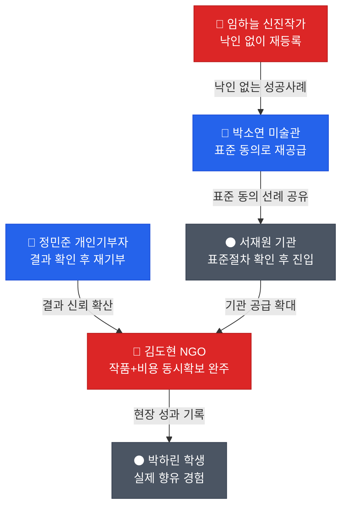

# 고객 여정지도 (CJM) — 예술품 재분배 × 미술품 토큰증권 가치순환 플랫폼

---

## CJM 01 · 핵심 사용자 (Core)

### C1. 김서윤 (34) — "팔리지 않아도 쓰임은 끝나지 않았다"

> **여정 특성:** 미판매·미전시 작품이 작업실에 쌓여 있지만 애착 때문에 처분을 미루는 전형적 독립 작가. 재분배 이후 작품이 실제로 어디서 어떻게 쓰이는지 확인받는 순간 재등록으로 이어지는 고빈도 사용자.

| 단계 | 고객 행동 | 고객 생각 | 감정 | Pain Point | 개선 기회 |
| --- | --- | --- | --- | --- | --- |
| **인지** | 작업실 정리 중 재분배 플랫폼 존재를 지인 소개로 접함 | "이거 그냥 기부하라는 건가, 아니면 뭔가 남는 게 있나?" | 호기심 + 경계 | 재분배와 단순 기증의 차이를 첫 화면에서 알 수 없음 | "다음 쓰임을 만든다"는 포지셔닝을 첫 화면 상단에 명시 |
| **고려** | 등록 화면에서 작품 정보·권리 조건 입력 시도 | "이거 등록하면 나중에 못 판다는 거 아니야?" | 신중 | 재분배 동의가 판매권까지 제한하는 건지 불명확 | 재분배/기록/상업활용/증권연계 4단 동의를 등록 화면에서 분리 표시 |
| **결정** | 어느 지역·기관으로 갈지 미리보기 확인 후 등록 확정 | "어디로 가는지 알고 보내는 거면 해볼 만하다" | 기대 | 수요처 정보 없이 등록만 요구하면 이탈 | 등록 전 예상 수요처 유형 미리보기 제공 |
| **이전** | 픽업·포장 진행 상황 확인 | "내 작품 지금 어디쯤 갔지?" | 긴장 | 이전 중 상태 확인 수단 없음 | 픽업-이동-도착 타임라인 알림 |
| **활용 확인** | 설치 사진·활용 결과 수신 | "버려지지 않고 다시 쓰이는구나" | 안도·만족 | 결과를 못 받으면 재등록 동기 소멸 | 설치·향유 확인을 작가에게 자동 회신 |

**감정 곡선:** 호기심·경계 → 신중 → 기대 → 긴장 → **안도·만족** **플랫폼 핵심 가치:** "폐기 대신, 확인 가능한 다음 쓰임"

---

### C2. 박소연 (41) — "전시되지 않는 작품의 다음 공간"

> **여정 특성:** 공공 미술관 컬렉션 담당자. 개인 작가와 달리 보존 책임과 내부 결재가 모든 결정을 선행한다. 목적별 동의 체계가 있어야만 결재선을 통과시킬 수 있다.

| 단계 | 고객 행동 | 고객 생각 | 감정 | Pain Point | 개선 기회 |
| --- | --- | --- | --- | --- | --- |
| **인지** | 소장품 실사 중 장기 미전시 작품 목록 확보 | "이 중 일부는 재분배 검토가 가능하지 않을까" | 책임감 | 재분배 검토 자체를 시작할 공식 계기가 없음 | 소장품 실사 주기에 맞춘 재분배 검토 안내 |
| **고려** | 플랫폼의 권리 조건 문서 검토 | "재분배 동의가 상업활용 동의로 확대 해석되면 안 돼" | 방어적 | 동의 항목이 뭉뚱그려져 있으면 결재 자체가 중단 | 재분배/기록/상업활용/증권연계 4개 항목을 별도 체크박스·서명란으로 분리 |
| **결정** | 법무·학예 부서 결재 회람 | "결재선에 올릴 근거 문서가 있어야 한다" | 신중 | 결재용 요약 문서가 없으면 반려 | 결재 첨부용 1페이지 요약 자동 생성 |
| **이전** | 운송·보험 조건 최종 확인 | "사고 나면 책임은 누가 지나" | 긴장 | 훼손·분실 책임 소재 불명확 | 작품별 보험·운송 책임 범위 명시 |
| **활용 확인** | 수령기관의 설치·활용 보고 수신 | "소장품이 실제로 의미 있게 쓰였다" | 만족 | 활용 보고가 없으면 다음 소장품도 내주지 않음 | 정기 활용 보고서 자동 발송 |

**감정 곡선:** 책임감 → 방어적 → 신중 → 긴장 → **만족** **플랫폼 핵심 가치:** "권리는 목적별로, 책임은 명확하게"

---

### C3. 이지현 (39) — "학교에서 실제 작품을 보여주고 싶다"

> **여정 특성:** 농어촌 중학교 미술교과 담당. 작품 자체보다 안전·관리 조건이 먼저 통과돼야 하는 페르소나. 관리 부담이 조금이라도 커지면 곧바로 이탈한다.

| 단계 | 고객 행동 | 고객 생각 | 감정 | Pain Point | 개선 기회 |
| --- | --- | --- | --- | --- | --- |
| **인지** | 외부 문화체험을 이동거리·안전 문제로 영상수업 대체한 직후 검색 유입 | "사진으로 볼 때랑 완전 다른데, 실물을 보여줄 방법이 없을까" | 아쉬움 | 실물 작품 대안이 검색되지 않음 | "학교로 오는 실제 작품" SEO 콘텐츠 |
| **고려** | 학교 공간·안전 조건에 맞는 작품 필터링 시도 | "작품 구하는 것보다 관리가 더 무서워요" | 불안 | 관리조건 사전 필터가 없으면 신청 자체를 포기 | 공간·관리조건 사전 필터 제공 |
| **결정** | 관리조건에 맞는 작품 확인 후 신청 | "이 정도면 우리 학교에서 감당 가능하다" | 안도 | 관리 부담 초과 시 신청 포기 | 관리조건 상세(온습도, 보안, 관람동선) 사전 고지 |
| **이전** | 수령·설치 일정 조율 | "누가 언제 설치해주는지 알아야 한다" | 긴장 | 수령·설치 담당·일정 불명확 시 도착해도 방치 | 수령·설치 담당 사전 확정 |
| **활용 확인** | 학생 감상·수업 연계 진행 | "사진으로 볼 때랑 완전 다르다는 반응이 나왔다" | 만족 | 전면 정규수업 연계는 부담 | 선택형 교육활동(동아리·감상시간)으로 강도 조절 |

**감정 곡선:** 아쉬움 → 불안 → 안도 → 긴장 → **만족** **플랫폼 핵심 가치:** "관리 가능한 조건이 확인된 작품만"

---

### C4. 정민준 (32) — "내 3만원이 어떤 작품을 움직였나"

> **여정 특성:** 정기후원 경험은 있으나 미술품 기부는 처음. 결과 확인 욕구는 강하지만 "가치상승 서사"는 명확히 거부한다는 것이 인터뷰에서 반증된 페르소나.

| 단계 | 고객 행동 | 고객 생각 | 감정 | Pain Point | 개선 기회 |
| --- | --- | --- | --- | --- | --- |
| **인지** | SNS에서 재분배 프로젝트 사연 접함 | "이 작품이 학교로 간다는 건데, 내 돈이 어디에 쓰이는 거지" | 공감 | 비용 항목(운송·보험·설치)이 뭉뚱그려 보임 | 항목별 비용 구성 투명 공개 |
| **고려** | 프로젝트 페이지에서 목표액 대비 조성률 확인 | "이 프로젝트가 실제로 완성될 수 있나" | 신뢰 검토 | 목표 미달 시 어떻게 되는지 불명확 | 목표 미달 시 처리 원칙(전액 미집행·환불) 사전 고지 |
| **결정** | 소액 기부 결제 진행 | "이 정도면 부담 없이 해볼 만하다" | 결정 | 결제 정보 과다 요구 시 이탈 | 결제대행(PG) 위탁으로 최소 정보만 수집 |
| **진행 대기** | 프로젝트 진행 상황 확인 | "내가 도운 게 실제로 움직이고 있나" | 기대 | 중간 신호 없으면 관심 소멸 | 매칭·이동·설치 단계별 알림 |
| **결과 확인** | 설치·활용 결과 수신 | "아이들이 실제로 작품을 봤다니 좋다" | 만족 | "이 기부가 작품 가치를 올렸다"는 서사 제시 시 오히려 불쾌 | 문화적 성과만 전달, 가치상승 언급 배제 |

**감정 곡선:** 공감 → 신뢰 검토 → 결정 → 기대 → **만족** **플랫폼 핵심 가치:** "내 기부의 결과를 확인하되, 가격 얘기는 하지 않는다"

---

### C5. 최은영 (44) — "사회공헌 결과를 숫자로 보여줘야 한다"

> **여정 특성:** 중견 제조기업 지속가능경영팀. 연말 성과보고 압박이 유일한 진입 계기이며, 실사 패키지가 없으면 결재 자체가 성립하지 않는다.

| 단계 | 고객 행동 | 고객 생각 | 감정 | Pain Point | 개선 기회 |
| --- | --- | --- | --- | --- | --- |
| **인지** | 연말 CSR 성과보고서 작성 기간에 재분배 프로젝트 소개 접함 | "이걸로 사회공헌 성과를 만들 수 있을까" | 실무적 관심 | 성과지표로 환산할 자료가 없음 | 지원 작품 수·지역·기관 단위 성과 요약 제공 |
| **고려** | 법무·재무 부서와 실사 자료 검토 | "토큰화 얘기는 CSR 보고서엔 빼야겠다" | 신중 | 실사 요청이 부서별로 반복 발생 | 법무·재무·CSR 통합 실사 패키지 1회 제공 |
| **결정** | 내부 결재 완료 후 후원 집행 | "결재는 통과했지만 투자 이슈와는 분리해야 한다" | 안도 | 투자·증권 이슈가 CSR 메시지와 섞이면 리스크 | CSR용 메시지와 가치이력 데이터를 완전히 분리 |
| **진행** | 프로젝트 진행 보고 수신 | "우리 지원이 실제로 어디에 쓰였나" | 관심 유지 | 진행 보고 형식이 CSR 보고서 양식과 안 맞음 | ESG 보고서 양식에 맞춘 결과 리포트 자동 생성 |
| **결과 보고** | 연차보고서에 성과 반영 | "숫자와 사진이 있으니 보고서에 넣기 좋다" | 만족 | 기존 ESG 지표와 중복되면 무의미 | 기존 CSR 성과와 차별화된 지표만 선별 제공 |

**감정 곡선:** 실무적 관심 → 신중 → 안도 → 관심 유지 → **만족** **플랫폼 핵심 가치:** "결재 통과용 실사 패키지를 한 번에"

---

## CJM 02 · 확장 사용자 (Adjacent)

### A1. 한유진 (29) — "졸업작품의 다음 쓰임이 필요하다"

> **여정 특성:** 미술대학 실기실 담당. 다수의 학생 작품을 동시에 처리해야 하며, 학생 개별 동의가 병목이다.

| 단계 | 고객 행동 | 고객 생각 | 감정 | Pain Point | 개선 기회 |
| --- | --- | --- | --- | --- | --- |
| **인지** | 졸업전시 종료 후 보관 공간 부족 확인 | "이 많은 작품을 다 어떻게 처리하지" | 압박 | 대량 처리 수단이 없음 | 다수 작품 일괄 등록 기능 |
| **고려** | 학생별 동의 수집 절차 확인 | "학생 동의를 개별로 다 받아야 하나" | 번거로움 | 동의 수집이 작품 수만큼 반복 | 온라인 일괄 동의 수집 링크 |
| **결정** | 일괄 등록 및 동의 완료 | "이 정도면 관리 가능하다" | 안도 | — | — |
| **이전·활용** | 재분배 결과 확인 | "학생 작품이 새로운 공간에서 쓰이는구나" | 뿌듯함 | — | — |

**감정 곡선:** 압박 → 번거로움 → 안도 → **뿌듯함** **플랫폼 핵심 가치:** "여러 학생 작품을 한 번에, 깔끔하게"

### A2. 윤태호 (37) — "미판매 작품을 마음대로 보낼 수는 없다"

> **여정 특성:** 상업 갤러리 작품관리·세일즈 6년차. 작가 계약 범위 밖의 재분배·증권화 검토는 진행 자체가 불가능하다.

| 단계 | 고객 행동 | 고객 생각 | 감정 | Pain Point | 개선 기회 |
| --- | --- | --- | --- | --- | --- |
| **인지** | 미판매 작품의 외부 전시·대여 검토 시점 | "새 전시 기회는 만들고 싶은데" | 관심 | — | — |
| **고려** | 작가 계약서상 권한 범위 확인 | "보관하고 있어도 처분권까지 가진 건 아니다" | 신중 | 권한 범위가 계약에 명시돼 있지 않음 | 계약 권한 범위 확인 체크리스트 |
| **결정** | 후속 수익배분 원칙 사전 합의 후 등록 | "나중에 돈 생긴 다음에 협의하면 싸운다" | 안도 | 배분 원칙이 사후 협의면 분쟁 소지 | 참여 시점에 수익배분 원칙 사전 명시 |
| **활용 확인** | 재전시·활용 결과 확인 | "모든 노출이 가치상승은 아니지만 활동이력은 된다" | 만족 | — | — |

**감정 곡선:** 관심 → 신중 → 안도 → **만족** **플랫폼 핵심 가치:** "배분 원칙은 참여 시점에, 분쟁 전에"

### A3. 오수진 (46) — "공간은 있는데 보여줄 작품이 부족하다"

> **여정 특성:** 지역 문화센터·도서관 담당. 공간은 있으나 지속적인 작품 공급이 관건.

| 단계 | 고객 행동 | 고객 생각 | 감정 | Pain Point | 개선 기회 |
| --- | --- | --- | --- | --- | --- |
| **인지** | 전시 기획 중 콘텐츠 부족 확인 | "매번 새로 작품을 찾는 게 지친다" | 피로 | 지속적 공급 경로 부재 | 정기 공급 파이프라인 등록 |
| **고려·결정** | 관리조건에 맞는 작품 신청 | "이 정도면 우리 시설에서 가능하다" | 안도 | — | — |
| **활용 확인** | 주민 향유 결과 확인 | "가까운 곳에서 실제 작품을 볼 수 있게 됐다" | 만족 | — | — |

**감정 곡선:** 피로 → 안도 → **만족** **플랫폼 핵심 가치:** "매번 새로 찾지 않아도 되는 공급망"

---

## CJM 03 · 극단 사용자 (Extreme)

### E1. 임하늘 (27) — "작업실이 작품으로 꽉 찼다"

> **여정 특성:** 보관 여력이 극도로 작은 신진 작가. 폐기 압박과 낙인 우려가 동시에 작동하는 가장 예민한 페르소나.

| 단계 | 고객 행동 | 고객 생각 | 감정 | Pain Point | 개선 기회 |
| --- | --- | --- | --- | --- | --- |
| **인지** | 이사 과정에서 작품 폐기를 실제로 고민 | "안 팔렸다는 것과 가치가 없다는 건 다른 얘기다" | 압박·애착 | 폐기 전 대안이 안 보임 | "순환 가능 작품" 프레이밍으로 대안 제시 |
| **고려** | 등록 화면의 언어 확인 | "'유휴·저평가' 같은 말이 등급표처럼 느껴진다" | 경계 | 부정적 언어 노출 시 즉시 이탈 | 유휴·저평가·폐기 대상이라는 표현 전면 금지 |
| **결정** | 처리 기한 확인 후 등록 | "기한이 확정돼 있으면 기다릴 수 있다" | 안도 | 무기한 대기 우려 | 등록 시 확정 매칭 기한 제시 |
| **이전** | 픽업·이동 확인 | — | 긴장 | — | — |
| **활용 확인** | 활용 이력 확인 | "가치가 올랐다고 말하면 오히려 못 믿을 것 같다" | 만족·경계 | 가치상승 서사 노출 시 신뢰 붕괴 | 이력은 "새 쓰임의 기록"으로만 제시 |

**감정 곡선:** 압박·애착 → 경계 → 안도 → 긴장 → **만족·경계** **플랫폼 핵심 가치:** "낙인 없이, 기한은 확실하게"

### E2. 김도현 (33) — "외부 지원 없이는 작품을 확보하기 어렵다"

> **여정 특성:** 문화취약지역 NGO 실무 5년차. 작품과 이전비용이 동시에 확보되지 않으면 실행 자체가 무산되는, 전체 페르소나 중 병목이 가장 강한 사용자.

| 단계 | 고객 행동 | 고객 생각 | 감정 | Pain Point | 개선 기회 |
| --- | --- | --- | --- | --- | --- |
| **인지** | 좋은 작품 제안을 받았으나 운송비 자비부담으로 수량 축소 경험 | "운송·설치가 무료여야 진짜 무료죠" | 좌절 | 작품과 비용이 따로 움직임 | 작품×Funding 동시 매칭 엔진 |
| **고려** | 작품+비용 동시 확보 프로젝트만 검토 | "받는 것과 쓰는 게 완전히 다른 문제다" | 신중 | 비용 미확보 시 착수 불가 | 목표액 100% 조성 전 실행 승인 차단 |
| **결정** | 동시 확보 확인 후 실행 | "이번엔 끝까지 갈 수 있겠다" | 안도 | — | — |
| **현장 실행** | 설치·교육 프로그램 진행 | "한 번 입력한 게 후원 보고에도 자동으로 쓰이면 좋겠다" | 기대 | 이중 입력 부담 | 현장 성과 단일 입력, 후원보고·작품이력 동시 반영 |
| **결과 보고** | 후원자·플랫폼에 결과 회신 | "이번엔 끝까지 완주했다" | 만족 | — | — |

**감정 곡선:** 좌절 → 신중 → 안도 → 기대 → **만족** **플랫폼 핵심 가치:** "작품과 비용, 동시에 확보되지 않으면 시작하지 않는다"

---

## CJM 04 · 비활성 사용자 (Non-user)

### N1. 서재원 (48) — "작품은 있어도 바로 내놓을 수 없다"

> **여정 특성:** 작품 보유기관 자산관리 담당. 유휴 작품이 있어도 권리·보존·책임 조건이 불명확하면 진입 자체가 불가능한 구조적 비활성 사용자.

| 단계 | 고객 행동 | 고객 생각 | 감정 | Pain Point | 개선 기회 |
| --- | --- | --- | --- | --- | --- |
| **인지** | 유휴자산 정리 검토 중 재분배 플랫폼 존재 확인 | "우리 기관도 대상이 될 수 있나" | 관심 | 참여 조건이 불명확 | 기관용 참여 가능성 자가진단 도구 |
| **고려** | 권리·보존·책임 조건 검토 | "소유권·저작권·보존상태가 하나라도 불명확하면 진행할 수 없다" | 방어적 | 표준 확인 절차 부재 | 표준 권리 체크리스트 제공 |
| **정체** | (대부분 진입 중단) | "책임 소재가 불명확하니 일단 보류한다" | 신중·정체 | 사고 발생 시 책임 주체 불명확 | 사고·훼손 책임 범위 사전 명시 |
| **(재진입 시) 참여** | 표준 절차 확인 후 재검토 | "이 정도면 승인 가능하다" | 조건부 수용 | — | — |

**감정 곡선:** 관심 → 방어적 → 신중·정체 → **조건부 수용** **플랫폼 핵심 전략:** 직접 유입보다 표준 동의·계약 문서 자체를 먼저 갖추는 것이 진입장벽을 낮추는 유일한 방법

### N2. 박하린 (14) — "플랫폼은 모르지만 작품은 경험한다"

> **여정 특성:** 문화취약지역 중학생. 플랫폼을 직접 사용하지 않지만 서비스 성과를 실제로 체감하는 최종 수혜자 — 이 여정의 완결이 곧 사업 전체의 성과 판정 기준이다.

| 단계 | 고객 행동 | 고객 생각 | 감정 | Pain Point | 개선 기회 |
| --- | --- | --- | --- | --- | --- |
| **접점 없음** | 평소 실제 작품을 접할 기회가 거의 없음 | "미술관은 너무 멀다" | 무관심 | 접점 자체가 없음 | 학교 내 설치로 접점 생성 |
| **작품 발견** | 학교에 설치된 작품을 처음 마주함 | "사진으로 볼 때랑 완전 다르다" | 놀라움 | 설명 없이는 그냥 지나침 | 눈높이에 맞춘 쉬운 해설 자료 |
| **향유·창작** | 수업·동아리 시간에 작품 관련 활동 참여 | "이 작품 보고 나도 그려보고 싶어졌다" | 흥미·자극 | 일회성 전시로 끝나면 효과 소멸 | 감상을 창작 활동으로 연결하는 프로그램 |

**감정 곡선:** 무관심 → 놀라움 → **흥미·자극** **플랫폼 핵심 전략:** 직접 사용자가 아니라 성과 판정의 기준 — 이 여정이 완결돼야 사업의 존재 이유가 증명된다

---

## 페르소나 간 여정 교차 인사이트

### 공통 Pain Point — 플랫폼이 반드시 해결해야 할 3가지

| 순위 | Pain Point | 해당 페르소나 | 해결 기능 |
| --- | --- | --- | --- |
| **1** | 작품과 이전비용이 따로 움직여 실행이 중단됨 | 김도현, 정민준, 임하늘 | 작품×Funding 동시 매칭 엔진 |
| **2** | 재분배·기록·상업활용·증권연계 동의가 뒤섞여 결재가 막힘 | 박소연, 윤태호, 서재원 | 4단 동의 분리 시스템 |
| **3** | 설치 후 실제 활용이 증명되지 않음 | 전원(12명 중 11명) | 수령·설치·활용 확인 원장 |

### 플랫폼 성장 경로 — 여정 연결 구조

### 단계별 핵심 개선 기회 요약

| CJM 단계 | 가장 큰 공통 Pain | 최우선 개선 기회 | 우선 해결 페르소나 |
| --- | --- | --- | --- |
| **인지** | 재분배와 단순 기증의 차이 불명확 | "다음 쓰임을 만든다" 포지셔닝 명시 | 김서윤, 정민준 |
| **고려** | 동의 범위·관리조건 불투명 | 4단 동의 분리 + 관리조건 사전 필터 | 박소연, 이지현 |
| **결정** | 작품과 비용의 동시 확보 여부 불확실 | 동시 매칭 엔진 + 사전 처리기한 확정 | 김도현, 임하늘 |
| **이전** | 진행 상태가 보이지 않음 | 픽업-이동-도착 타임라인 알림 | 김서윤, 박소연 |
| **활용 확인** | 설치 후 실제 활용이 증명되지 않음 | 수령·설치·활용 확인 원장, 청중별 리포트 분리 | 전원 |
